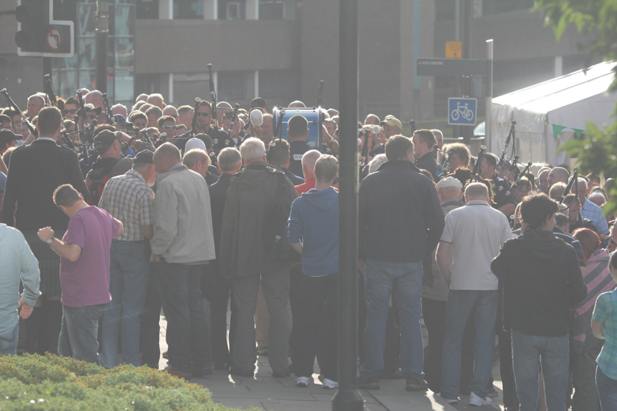
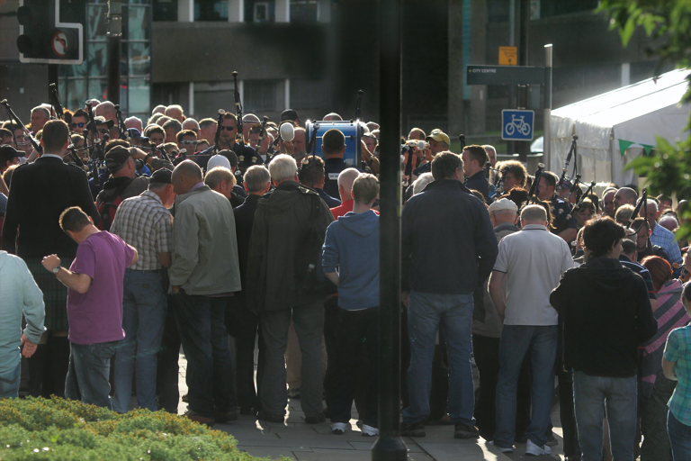

## Complex haze data synthesis based real-world image dehazing with enhancement-and-restoration fused CNNs

---

by XX.

### Citation


### Dependencies and Installation

* python3.7
* PyTorch>=1.4
* NVIDIA GTX 2080ti GPU
* numpy
* matplotlib

### Datasets Preparation

Dataset website:[FiveK dataset](https:XX/) ; Paper arXiv version:[[paper name](https://www)] ; Synthetic hazy dataset:[FiveK-Haze dataset](https:baiduyun/)

<details>
<summary> FILE STRUCTURE </summary>

```
    Net
    |-- README.md
    |-- net
    |-- data
        |-- FiveK-Haze
            |-- train_hazy
                |-- *.png
            |-- val_hazy
                |-- *.png
            |-- test_hazy
                |-- *.png
            |-- gt
                |-- *.png
```
</details>


### Metrics update
|Methods|Make3D-Haze|NTIRE-Haze|FiveK-haze(PSNR/SSIM)|
|-|-|-|-|
|DCP|19.1/0.81|16.0/0.60|19.1/0.83|
|NLD|15.2/0.67|14.9/0.49|17.2/0.78|
|CAP|16.2/0.66|16.5/0.64|16.2/0.76|
|BCCR|14.3/0.71|12.8/0.48|12.0/0.64|
|AOD|16.8/0.79|16.1/0.62|16.9/0.75|
|FFA|14.3/0.53|13.5/0.41|16.0/0.64|
|GDN|18.9/0.81|14.3/0.52|25.8/0.94|
|MSBDN|22.5/0.86|18.1/0.68|22.7/0.87|
|Ours|22.0/0.87|17.2/0.65|27.4/0.98|
### Usage

#### Train

*Remove annotation from [main.py](net/main.py) *

*If you have more computing resources, expanding `bs`, `crop_size`, `gps`, `blocks` will lead to better results*

train network on `FiveK-Haze` dataset

 ```shell
 python main.py --net='AtJF' --crop --crop_size=320 --blocks=19 --bs=4 --lr=0.0005 --trainset='train_hazy' --valset='val_hazy' 
 ```

#### Test

Trained_models are available at baidudrive: https://pan.baidu.com/s/goodmodel with code: `XXXX`


*Put  models in the `model_path/`folder.*


*Put your images in `test_path/`*

 ```shell
 python test.py 
```
#### Samples

<p align='center'>
 


</div>

<p align='center'>
 


</div>

